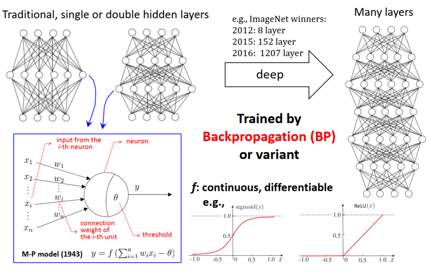

# 深度森林

## 1.方法思路

深度学习一直被认为具有强大的预测功能，与广度学习相比，深度学习的方式能更高效的逼近数据的分布函数，具体地，以下图为例：

#### 广度学习：

$$
f(g(x))
$$

增加x的个数（隐层神经元个数）

#### 深度学习：

$$
f_n(f_{n-1}....(f_{0}(g(x))))
$$

增加映射的层数（隐层数量）

添加多层映射函数的方式会比增加变量个数的方式能更高效拟合数据分布

#### 深度学习优势：

逐层处理、模型内特征转换、足够的模型复杂性

以上图为例，做一个三分类的问题，输入图片，输出类别（汽车、马、狗）

**逐层处理：**

深度神经网络从最开始的输入层，逐层进行映射（每一个M-P神经元可以看作一层f）

**模型内特征转换:**

如上图所示，原始的输入层经过三个隐层（映射）后，得到图片逐渐有了一些形状，这对于分类问题来说，这些特征能够进行很好的分类

**足够的复杂性：**
$$
f_n(f_{n-1}....(f_{0}(g(x))))
$$
随着隐层数量的增多，复合函数的层数就会变多，模型复杂度便会对着深度一起增长，对于复杂的数据也能起到很好的预测效果。

#### 深度学习缺点：

网络结构复杂，参数多；训练依赖梯度，但是有些模型梯度不可求（不可微）；调参经验不可复制，图像到音频不可复制；

#### 深度森林的想法：

决策树算法中参数比深度神经网络的参数要少，有些算法不用求梯度，并且也能对特征进行逐层处理，但是与深度神经网络不同的是，决策树算法只是对原始特征进行处理，并未提取出对预测任务强有效的特征。除此之外，单棵决策树模型过于简单，复杂度不够，不能对复杂数据实现预测任务。

现有的方法中有bagging、boosting之类的方法能够集成多棵树的结果，后续就考虑用集成的方式去增加模型复杂度。对于集成模型来说，控制好基分类器的准确性与基分类器分类结果的多样性是至关重要的一件事。但是这对于模型复杂度来说还不够复杂，于是提出了级联森林的想法。一个随机森林是一个集成算法，如果把一个随机森林算法看作一层f，把上一个随机森林的结果传入到下一个随机森林，便可以得到映射的叠加，更能增加模型复杂度。

但此时生成新特征的问题还没有解决，因为要借鉴深度学习的有点进行构建方法，所以文章中借鉴了深度神经网络中类似于CNN卷积核特征提取的方式，称之为多粒度扫描，每次输入级联森林的特征维数不同，尺度逐渐增大。

结合这两种深度学习的技巧，深度森林便被提了出来。

## 2.方法介绍

后续介绍都以三分类的任务作为背景

#### 级联森林：

级联森林的做法是把每一级输出的分类概率输出（三维向量）作为下一层的一部分输入，同时结合原始的特征作为下一层的全部输入，每一级循环此过程，直至最后一层的输出概率，取平均然后取概率最大的那一类作为预测结果。

这种做法与集成学习中的stacking策略类似，但是与stacking略有不同，stacking通常情况下三层就会出现过拟合的情况。

#### 多粒度扫描：

假设数据特征维数为400

对于序列数据，采用窗口长度为100进行滑窗取特征，输入到一个分类器便能得到301*3维的输出结果，通过上图的操作，便能把原始400维的输入映射到1806（903+903）维的特征空间。

对于图像数据，采用类似于卷积核的方式提取局部信息，输入到分类器，并把最终输出拼接成一列向量。

这种多粒度扫描的策略类似于cnn中的卷积核提取局部特征，这种方式放在集成学习中可以 增加基分类器分类结果的多样性。

#### 深度森林全过程：

原始的400维特征经过三次多粒度扫描之后，分别映射到了1806，1206，606维，并把这一层的输出当作级联森林的原始输入。接着，在级联森林中，每一级由Level *A，Level *B，Level *C构成，分别对应原始的1806维、1206、606维；在其内部，采用的是串联结构，Level 1A→Level 1B→Level 1C→Level 2A→Level 2B→Level 2C......,每一级向后传递信息过程中，会拼接每一次四个分类器的输出12维（4个\*3类），关于这部分过程，个人理解成过滤信息或者说提取有效信息的过程。到最后一层采用常用的策略，先去基分类的三类平均概率，然后再取最大的一类作为分类结果。

在其参数这块儿，可以看图示上的Forest下标，包括两大块儿，第一块儿是多粒度扫描中的森林设置参数（每一个森林不同），第二块儿是级联森林中的森林参数设置（参数设置相同，下标相同）

参数对比：

参数设置上要比深度神经网络少了很多，而且在文章中的实验显示，使用默认参数实验结果也不会差太多。

### 总结

1.深度森林的提法在文章中解释的很清楚，这种思考问题的方式很值得借鉴

2.方法目前代码封装的较好，与sklearn中的其他包调用类似，使用的时候调一下参数、换一下分类器就可以作为一个不错的baseline
